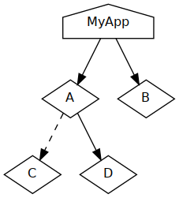

# Cmake monorepo example with optional package manager dependency management

This project consists of five individual repos in one big monorepo:

- `a/`
- `b/`
- `c/`
- `d/`
- `app/`

These have the following dependency tree:



The whole idea of this example repository is to show that this whole repo
can be used in two different scenarios:

1. Using legacy package management or one large docker image, the whole project
   and its libraries can be built in one large step using the workflow:

   ```bash
   mkdir build && cd build
   cmake ..
   make
   ```
2. Using `nix`, individual packages can be built as packages in a way that they
   can be cached individually and reference each other:

   ```bash
   nix-build release.nix -A myapp # other attributes to build are a, b, c, and d
   ```

# Workflow PROs and CONs

Let's compare what each workflow buys us

## Legacy workflow

### PRO Legacy

- Fine-granular rebuilds: If one file is touched, the build system will find out
  itself what the minimal rebuild set is. Incremental builds are faster during
  development.
- Legacy workflow is what people are used to:
  Either install all needed packages globally, or run a docker image as
  developer shell and be able to edit anything in the monorepo

### CON Legacy

- The dependency closure is the superset of all modules. All modules see all
  dependencies.
- If the repository is checked out, everything in this folder that is not a
  globally available dependency, must be rebuilt.
  Although the libraries in this repo are libraries like the globally installed
  ones, there is an artificial difference between them.

## Nix workflow

### Pro Nix

- Fine granular dependency closures: For every module, the right minimal
  closure can be instantiated without unneeded dependencies. This enforces
  structure.
- Libraries can be cached by external machines.
- There is no difference between globally available system libraries and local
  libraries any longer. Both can be substituted by locally patched versions
  without putting the burden on the developer to manage include/link settings.
- As it makes no difference if a library is in this repository or anywhere else,
  libraries can easily be "outsourced" to other repos.

### Contra Nix

- It may look alien to users of legacy systems that another shell has to be
  started for development in every module of this project.
- If something is changed in e.g. library `D`, then `A` and `MyApp` have to be
  not only relinked but rebuilt. The smaller the individual packages are, the
  lesser is this a problem.open source

# References

The `find_package`-NOP macro idea originates from Daniel Pfeifer's talk about
CMake at the C++Now 2017 conference:
https://www.youtube.com/watch?v=bsXLMQ6WgIk
